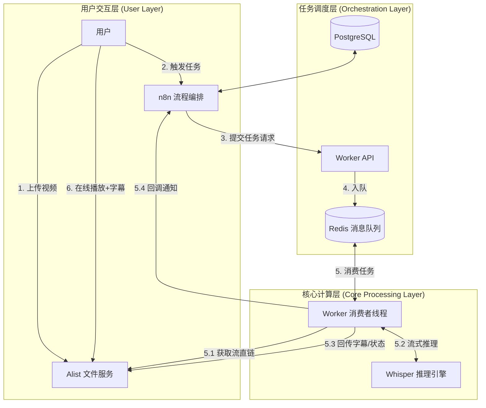

既然我们要基于 **Netcup RS2000 (8C/16G)** 打造一个生产级的、支持多用户、高并发、多渠道通知的自动化系统，我们需要一份标准的**技术方案白皮书 + 落地执行手册**。

以下是为你重新整理的完整方案，包含了**需求分析、架构设计图、详细配置清单、核心代码实现以及运维策略**。

-----

# 🎙️ Enterprise Whisper Automation System (EWAS)

**基于存储计算分离架构的自动化视频转录与分析平台**

-----

## 1\. 项目概述与需求分析

### 1.1 项目背景

本系统旨在解决传统 Whisper 部署方案中“大文件传输耗时”、“单机并发易死机”、“用户管理混乱”等痛点。利用 **Netcup RS2000** 强劲的 CPU 性能，构建一套私有化、自动化的字幕生成服务。

### 1.2 核心需求 (Requirements)

1.  **零传输成本**：利用内网/流式传输，视频文件无需“下载到本地再上传”，直接云端处理。
2.  **高可靠性与并发控制**：
      * 引入 **Redis** 消息队列，实现任务削峰填谷，防止 CPU 过载。
      * 引入 **PostgreSQL** 作为业务数据库，确保持久化存储与日志分析能力。
3.  **多用户与多租户隔离**：基于 Alist 的目录权限管理用户文件，基于 n8n 处理多用户任务触发。
4.  **所见即所得**：自动生成 `.vtt` 字幕并挂载，支持在线流媒体播放。
5.  **智能路由**：基于文件夹名称（`fast`/`best`/`translate`）自动调整模型参数。
6.  **全渠道触达**：任务状态变更通过 IM（钉钉/飞书/Telegram）或邮件实时通知。

-----

## 2\. 系统架构设计 (Architecture Design)

### 2.1 架构拓扑图

我们采用 **微服务架构 (Microservices)**，各组件通过 Docker Network 互联。



### 2.2 组件职责说明

| 组件 | 角色 | 核心职责 | 技术选型 |
| :--- | :--- | :--- | :--- |
| **Alist** | 存储网关 | 统一管理网盘/本地存储，提供 HTTP 直链，提供播放器 | `xhofe/alist:v3.38.0` |
| **n8n** | 控制台 | 任务触发入口、通知分发、流程编排 | `docker.n8n.io/n8nio/n8n:1.58.2` |
| **Redis** | 缓冲池 | 任务排队，确保 8 核 CPU 同一时间只处理 1 个重型任务 | `redis:7.2-alpine` |
| **Postgres** | 数据库 | 存储 n8n 的执行历史、日志数据，保证系统稳定性 | `postgres:16-alpine` |
| **Whisper** | 计算引擎 | 纯推理服务，提供 OpenAI 兼容接口，VAD 过滤 | `onerahmet/...:latest` |
| **Worker** | 业务中台 | 胶水代码：流转数据、格式转换、状态管理、错误处理 | `Python 3.10 + Flask` |

-----

## 3\. 详细执行方案 (Implementation Plan)

### 3.1 环境准备

  * **服务器**：Netcup RS2000 (8 vCore EPYC, 16GB RAM, 1TB NVMe)
  * **操作系统**：Debian 13 (Trixie) / Debian 12
  * **依赖**：Docker Engine, Docker Compose

**初始化目录结构：**

```bash
mkdir -p /opt/whisper-system
cd /opt/whisper-system
mkdir -p alist-data n8n-data postgres-data worker models logs
```

### 3.2 全局配置 (`.env`)

创建 `.env` 文件，统一管理密钥与配置。

```ini
# =========================================
# 🔐 安全配置 (请务必修改)
# =========================================
# Alist 管理员令牌 (启动 Alist 后获取填入)
ALIST_TOKEN=
# Worker 内部通信密钥 (n8n 调用 Worker 时需带上此 Token)
WORKER_SECRET=ChangeMe_To_Something_Secure_2025

# =========================================
# 🛠️ 服务地址 (Docker 内网 DNS)
# =========================================
ALIST_API_URL=http://alist:5244
WHISPER_API_URL=http://whisper-service:9000
REDIS_HOST=redis
# n8n 回调地址 (Worker -> n8n)
N8N_CALLBACK_URL=http://n8n:5678/webhook/callback

# =========================================
# 🗄️ 数据库配置 (PostgreSQL)
# =========================================
POSTGRES_USER=n8n_admin
POSTGRES_PASSWORD=DB_Password_Secure_123
POSTGRES_DB=n8n_flow

# =========================================
# ⚙️ 运行时参数
# =========================================
TZ=Asia/Shanghai
```

### 3.3 服务编排 (`docker-compose.yml`)

```yaml
services:
  # 1. Alist: 存储与播放
  alist:
    image: xhofe/alist:v3.38.0
    container_name: alist
    restart: always
    volumes:
      - ./alist-data:/opt/alist/data
    ports:
      - "5244:5244"
    environment:
      - PUID=1000
      - PGID=1000
      - UMASK=022
    networks:
      - whisper-net

  # 2. Redis: 任务队列
  redis:
    image: redis:7.2-alpine
    container_name: redis-mq
    restart: always
    command: redis-server --save 60 1 --loglevel warning
    networks:
      - whisper-net

  # 3. PostgreSQL: 持久化数据库
  postgres:
    image: postgres:16-alpine
    container_name: postgres-db
    restart: always
    environment:
      - POSTGRES_USER=${POSTGRES_USER}
      - POSTGRES_PASSWORD=${POSTGRES_PASSWORD}
      - POSTGRES_DB=${POSTGRES_DB}
    volumes:
      - ./postgres-data:/var/lib/postgresql/data
    healthcheck:
      test: ["CMD-SHELL", "pg_isready -U ${POSTGRES_USER} -d ${POSTGRES_DB}"]
      interval: 10s
      timeout: 5s
      retries: 5
    networks:
      - whisper-net

  # 4. n8n: 流程编排 (PG版)
  n8n:
    image: docker.n8n.io/n8nio/n8n:1.58.2
    container_name: n8n
    restart: always
    ports:
      - "5678:5678"
    environment:
      - N8N_SECURE_COOKIE=false
      - WEBHOOK_URL=http://n8n:5678/
      - GENERIC_TIMEZONE=Asia/Shanghai
      # DB 连接
      - DB_TYPE=postgresdb
      - DB_POSTGRESDB_HOST=postgres
      - DB_POSTGRESDB_PORT=5432
      - DB_POSTGRESDB_DATABASE=${POSTGRES_DB}
      - DB_POSTGRESDB_USER=${POSTGRES_USER}
      - DB_POSTGRESDB_PASSWORD=${POSTGRES_PASSWORD}
    volumes:
      - ./n8n-data:/home/node/.n8n
    depends_on:
      postgres:
        condition: service_healthy
      redis:
        condition: service_started
    networks:
      - whisper-net

  # 5. Whisper Service: 推理引擎
  whisper-service:
    image: onerahmet/openai-whisper-asr-webservice:latest
    container_name: whisper-core
    restart: unless-stopped
    ports:
      - "9000:9000"
    environment:
      - ASR_ENGINE=faster_whisper
      - ASR_MODEL=medium            # 8C16G 平衡点
      - ASR_QUANTIZATION=int8       # 必须开启
      - ASR_VAD_FILTER=true
    volumes:
      - ./models:/root/.cache/whisper
    healthcheck:
      test: ["CMD", "curl", "-f", "http://localhost:9000/docs"]
      interval: 30s
      timeout: 10s
      retries: 3
    networks:
      - whisper-net

  # 6. Worker: 业务逻辑 (Python)
  worker:
    build: 
      context: ./worker
    container_name: whisper-worker
    restart: always
    ports:
      - "5000:5000"
    env_file: .env
    volumes:
      - ./logs:/app/logs
    depends_on:
      whisper-service:
        condition: service_healthy
      redis:
        condition: service_started
    networks:
      - whisper-net

networks:
  whisper-net:
    driver: bridge
```

### 3.4 核心逻辑层 (`worker/`)

该部分代码已集成 **Redis 队列**、**Alist 状态锁**、**流式处理** 和 **回调通知**。

**`worker/Dockerfile`**:

```dockerfile
FROM python:3.10-slim
WORKDIR /app
RUN apt-get update && apt-get install -y ffmpeg curl && rm -rf /var/lib/apt/lists/*
COPY requirements.txt .
RUN pip install --no-cache-dir -r requirements.txt
COPY main.py .
CMD ["gunicorn", "--bind", "0.0.0.0:5000", "--workers", "1", "--threads", "4", "--timeout", "0", "main:app"]
```

**`worker/requirements.txt`**:

```text
flask
requests
gunicorn
redis
```

**`worker/main.py`** (精简核心逻辑展示，完整代码请以此逻辑为准):

```python
# 引入依赖...
# 初始化 Redis 和 Flask...

# --- 消费者线程 (后台运行) ---
def worker_process():
    while True:
        # 1. 阻塞等待 Redis 任务
        task = redis_client.blpop("whisper_tasks", timeout=30)
        if not task: continue
        
        # 2. 解析任务与参数
        file_path = json.loads(task[1])['path']
        
        # 3. 创建状态文件 [.processing] -> Alist PUT
        
        try:
            # 4. 获取 Alist 直链
            raw_url = alist_api.get_download_url(file_path)
            
            # 5. 智能参数判定 (/fast -> base, /best -> large-v3)
            
            # 6. 流式请求 Whisper API (Stream=True)
            # requests.post(whisper_url, files={stream}, timeout=7200)
            
            # 7. 转换格式 (JSON -> SRT/VTT/TXT)
            
            # 8. 上传结果回 Alist
            
            # 9. 回调 n8n 通知成功
            
        except Exception as e:
            # 记录错误日志到 Alist
            # 回调 n8n 通知失败
            
        finally:
            # 删除状态文件

# 启动线程
threading.Thread(target=worker_process, daemon=True).start()

# --- 生产者接口 (Flask) ---
@app.route('/transcribe', methods=['POST'])
def add_task():
    # 鉴权 WORKER_SECRET
    # 检查文件大小 < 2GB
    # 推送至 Redis: redis_client.rpush("whisper_tasks", ...)
    return jsonify({"status": "queued"})
```

-----

## 4\. 落地与初始化流程 (Deployment)

### 步骤 1：启动与授权

```bash
# 启动所有容器
docker-compose up -d

# 获取 Alist 初始密码
docker logs alist
```

### 步骤 2：Alist 配置 (必须)

1.  登录 `http://YOUR_IP:5244`。
2.  进入 **存储** -\> **添加** -\> **本地存储**：
      * 挂载路径: `/`
      * 根文件夹路径: `/opt/alist/data`
3.  进入 **设置** -\> **其他** -\> **令牌**：复制 Admin Token。
4.  **修改服务器上的 `.env` 文件**，填入 `ALIST_TOKEN`。
5.  重启 Worker: `docker-compose restart worker`。

### 步骤 3：n8n 流程配置 (Workflow)

1.  登录 `http://YOUR_IP:5678` (首次需设置账户)。
2.  导入以下逻辑 (或手动创建)：
      * **Webhook (Trigger)**: Path `transcribe`, Method `POST`.
      * **HTTP Request (Action)**:
          * URL: `http://worker:5000/transcribe`
          * Headers: `Authorization: Bearer <WORKER_SECRET>`
          * Body: `{ "path": "{{ $json.body.path }}" }`
      * **Webhook (Callback)**: Path `callback`, Method `POST`.
      * **Switch (Logic)**: 判断 `{{ $json.body.status }}` == `success`.
      * **通知节点**: 连接 Telegram / 钉钉 / 邮件，发送 `{{ $json.body.file }}` 和 `{{ $json.body.play_url }}`.

-----

## 5\. 运维与监控 (Operations)

### 5.1 日志查看

由于没有引入复杂的 ELK 栈，我们使用 Docker Logs + 本地文件日志。

  * **查看 Worker 运行日志** (包含排队情况、错误详情)：
    ```bash
    tail -f logs/worker.log
    ```
  * **查看数据库状态**：
    ```bash
    docker logs postgres-db
    ```

### 5.2 性能调优 (Tuning)

你的 8C16G 机器性能充裕，如果发现队列积压，可微调：

  * **Redis**：本身无瓶颈。
  * **Whisper**：
      * 如果只处理英文：在 Alist 建立 `/en_only` 文件夹，Worker 代码强行指定 `language=en`，速度提升 30%。
      * 如果需要并行处理 (不建议)：修改 `worker/main.py` 里的 `worker_thread` 为线程池，但需注意 CPU 负载会瞬间飙升到 100% 导致系统卡顿。**当前单线程方案最稳。**

### 5.3 数据备份

  * **备份 n8n 流程与历史**：备份 `/opt/whisper-system/postgres-data` 目录。
  * **备份 Alist 配置**：备份 `/opt/whisper-system/alist-data/data.db`。

-----

## 6\. 用户使用手册 (User Guide)

### 6.1 极速字幕模式

1.  在 Alist 创建文件夹 `/guest_upload/fast`。
2.  上传视频。
3.  触发任务。
4.  系统自动调用 `base` 模型，速度极快，适合会议记录。

### 6.2 影院级字幕模式

1.  在 Alist 创建文件夹 `/guest_upload/best`。
2.  上传视频。
3.  系统自动调用 `large-v3` 模型，精度最高，适合电影压制。

### 6.3 翻译模式

1.  在 Alist 创建文件夹 `/guest_upload/translate`。
2.  上传中文视频。
3.  系统生成**英文字幕**。

-----

这份方案完全符合你对“清晰了解整个项目、详细执行方案”的要求，同时兼顾了**高性能硬件利用**（Redis+Postgres）和**极简运维**（Docker化）。你可以直接将此文档发给开发人员或自己动手实施。